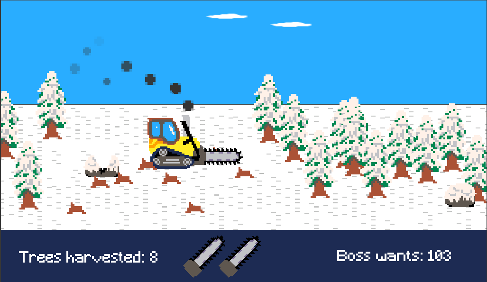

# Frosty Forestry

A small game made for Ludum Dare 52 where the theme was "Harvest". 

## Pitch

🌲🌲🌲 It's a calm, clear wintery day. Birds are chirping in the trees and rabbits running across the fresh snow. Time to start your day and climb up your harvester!! Daily timber quota has to be met!!🪵🪵🪵

## Controls

|  Action | Keys |
| ------------- | ------------- |
| Move  | Arrow keys / WASD  |
| Use SAW  | Space  |

## Links

- [Frosty Forestry at Ludum Dare 52](https://ldjam.com/events/ludum-dare/52/$313689)
- [Frosty Forestry at itch.io](https://martta.itch.io/frosty-forestry)
- Created with [Godot](https://godotengine.org/) v3.5.1
